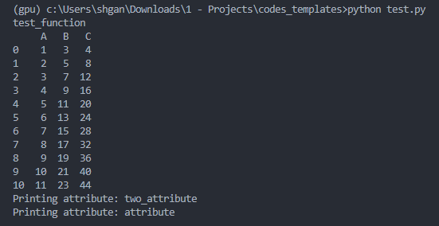

# install_local_packages

## About The Project
This repository shows how to install local python packages so that the user can access them globally. This is useful when the user wants to use the same package in multiple projects.

There are two ways to install local packages:
1. Using `-e` flag to tell pip install to read package in an editable mode so that package does not need to be reinstall after making any changes to local codes.
    - Using `-U` flag tells pip install to upgrade the package if it is already installed.
2. Building a **source distribution** for your package and pip installing it.
    - Useful when you want to share the package with other users.


## Directory Tree
```sh
.
├── TestPackage
│   ├── __init__.py
│   ├── one.py
│   └── two.py
├── MANIFEST.in
├── README.md
├── requirements.txt
└── setup.py
```
\* **Note**: `dist` folder and `tar.gz` file will be created after running `python setup.py sdist`


## Prerequisites
The following setup requires the following packages to be installed:
1. pip
2. setuptools
    - pkg_resources (should be included while installing setuptools)
3. pandas (this package is used in the example package: **TestPackage** that we will be installing)

``` sh
pip install -r requirements.txt
```


## Usage
### Option 1: Install in editable mode
``` sh
pip install -e .
```
### Option 2: Building sdist and installing it
``` sh
python setup.py sdist
pip install ./dist/<PACKAGE.tar.gz>
```


## Demo
Sample test cases are written in the test.py file. [Here](https://github.com/shaohong-g/codes_templates/blob/main/test.py) 

Image below shows the output of the test.py file:



## Useful Articles / Acknowledgements
1. requirements.txt
    - [Writing requirements.txt](https://note.nkmk.me/en/python-pip-install-requirements/)
2. setup.py
    - [setup.py template](https://github.com/pypa/sampleproject/blob/main/setup.py)
    - [find_packages usage (sub-directory)](https://stackoverflow.com/questions/54430694/python-setup-py-how-to-get-find-packages-to-identify-packages-in-subdirectori)
    - [Nested modules](https://stackoverflow.com/questions/24351441/including-nested-modules-in-setup-script)
    - [sdist vs bdist](https://stackoverflow.com/questions/6292652/what-is-the-difference-between-an-sdist-tar-gz-distribution-and-an-python-egg)
    - [Include package_data when building sdist -1](https://stackoverflow.com/questions/11848030/how-include-static-files-to-setuptools-python-package)
    - [Include package_data when building sdist -2](https://stackoverflow.com/questions/7522250/how-to-include-package-data-with-setuptools-distutils)
    - [Accessing package_data -1](https://jwodder.github.io/kbits/posts/pypkg-data/)
    - [Accessing package_data -2 (this is what we are using)](https://kiwidamien.github.io/making-a-python-package-vi-including-data-files.html)
    - [Accessing data_files](https://stackoverflow.com/questions/58048482/how-to-access-data-files-specified-in-setup-py-during-runtime)

3. Manifest.in
    - [What is Manifest.in?](https://stackoverflow.com/questions/24727709/do-python-projects-need-a-manifest-in-and-what-should-be-in-it)
    - [Official guide to Manifest.in](https://packaging.python.org/en/latest/guides/using-manifest-in/)
4. \_\_init\_\_.py
    - [What is init file use for?](https://stackoverflow.com/questions/448271/what-is-init-py-for])
    - [What do we include in init.py](https://www.reddit.com/r/Python/comments/1bbbwk/whats_your_opinion_on_what_to_include_in_init_py/)
    - [Import modules from parent folder](https://stackoverflow.com/questions/714063/importing-modules-from-parent-folder)


## Commands used while developing
- `python -m pip install --upgrade setuptools`
- `pip install -r requirements.txt`
- `pip install -e .`
- `pip install -U .`
- `python setup.py sdist # bdist_wheel`
- `pip install ./dist/PACKAGE.tar.gz`

