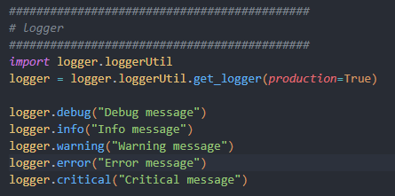
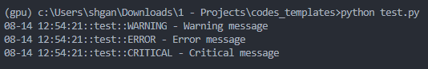
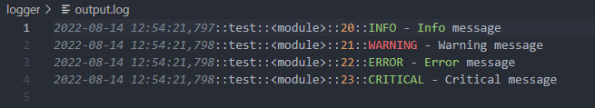

# logger

## About The Project
This repository shows the basic set-up for a logger object in Python. The logger object is a simple wrapper around the Python logging module and is able to log messages to a file and the console.

## Directory Tree
```sh
.
├── getLogger.py
└── README.md
```

## Prerequisites
The following libraries are required to run the script:
1. logging
2. inspect

No installation is required as these libaries are installed together with Python.

## Usage
``` python
# From other files
import loggerUtil
logger = loggerUtil.getLogger()
```

## Demo
Sample test cases are written in the test.py file. [Here](https://github.com/shaohong-g/codes_templates/blob/main/test.py) 

### Test.py
Production logger level: 
- console: logging.WARNING
- file: logging.INFO
- Others: logging.INFO



### Console


### File stream



## Further development
1. Install it as local package in editable mode
    - refer to `install_local_packages` repository
2. Include colouring in python logging output
    - refer to `Useful Articles / Acknowledgements` section for more details

## Useful Articles / Acknowledgements
- [Logging guide 1 - from realpython](https://realpython.com/python-logging/)
- [Logging guide 2 - from machinelearningplus](https://www.machinelearningplus.com/python/python-logging-guide/)
- [Logging Documentation](https://docs.python.org/3/howto/logging.html)
- [Logging output coloring](https://stackoverflow.com/questions/384076/how-can-i-color-python-logging-output)
