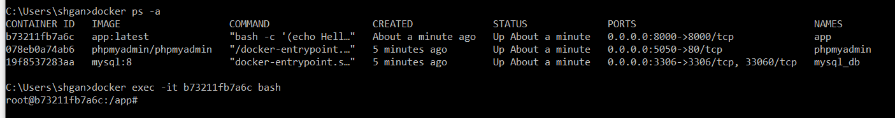
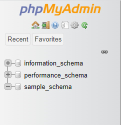
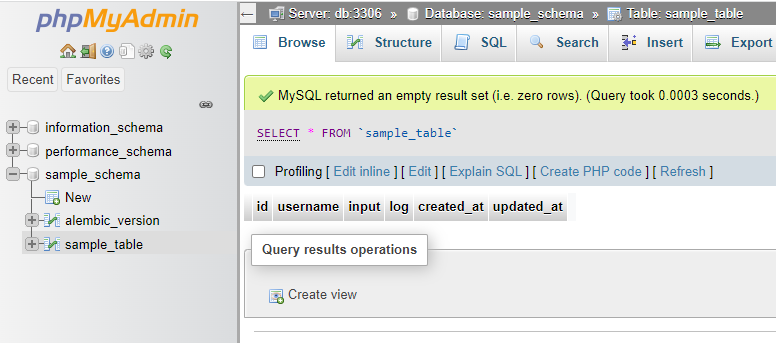
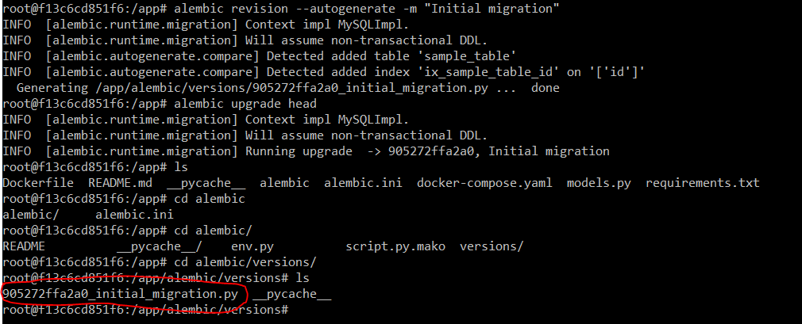
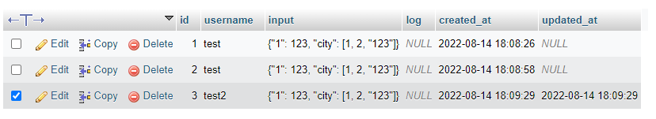
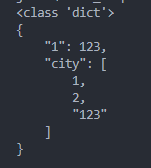

# python_alembic

## About The Project
This repository shows how to set up alembic and create/migrate database tables. This is useful if users want to set-up cross-container database and ensure that everyone in the team has the right schema. In this repository, we use `mySQL` as the database.

\* *Note that below is only a variation of how alembic can be used to setup a database schema.*

## Directory Tree
```sh
.
├── alembic
│   ├── versions/
│   ├── env.py
│   ├── README
│   └── script.py.mako
├── .env
├── alembic.ini
├── docker-compose.yaml
├── Dockerfile
├── models.py
├── README.md
└── requirements.txt
```
**Do create the versions folder if it does not exist.**

## Prerequisites
Currently, this repository has **already ran** alembic initialization via the command:
```sh
alembic init alembic
```
The `env.py` and `alembic.ini` file have been edited, namely:
- *env.py* line 9-15
- *env.py* line 22-30
- *env.py* line 43-44
- *alembic.ini* line 58

The following setup requires the following packages to be installed:
1. alembic
2. pymysql *(SQL implementation)*
3. SQLAlchemy
4. cryptography
5. python-dotenv
6. psycopg2 *(postgresql implementation)*
7. psycopg2-binary *(depending on which docker image you use)*

*Note that the above packages are not required if you are dockerizing everything.*

## Usage
1. Make sure that the DB_HOST in .env is set correctly:
    ```sh
    DB_HOST=db
    ```
2. Run the following command to start multiple docker containers:
    ```sh
    docker-compose up
    ```
3. Access `localhost:5050` PHPMyAdmin for better visibility of the database
    - Default username: `admin`
    - Default password: `admin`
4. Run another container instance in the background
    - Get the container id
    ```sh
    docker ps -a
    ```
    - Access the running container *(check Demo for illustration)*
    ```sh
    docker exec -it <container id> bash
    ```
5. Run the following commands to create the schema:
    ```sh
    alembic revision --autogenerate -m "Initial migration"
    alembic upgrade head
    ```
6. Test the script via test.py (make sure to change `DB_HOST=localhost` to allow communication between containers and our localhost)
    ```sh
    python test.py
    ```

## Demo
Sample test cases are written in the test.py file. [Here](https://github.com/shaohong-g/codes_templates/blob/main/test.py) 

### Access the running container instance
There are many ways to run the containers (e.g. docker run another image) or we can even set up locally.



### Migration
- Schema before and after migration




- file generated from the command `alembic revision --autogenerate -m "Initial migration"` under the `versions` folder



### test.py output
- `username` change from **test** to **test2**. `updated_at` column is automatically updated.



- Console output showing how json object is retrieved from the database.



## Useful Articles / Acknowledgements
- [Sqlalchemy Orm](https://www.tutorialspoint.com/sqlalchemy/sqlalchemy_orm_creating_session.htm)
- [Run docker container in foreground](https://stackoverflow.com/questions/30209776/docker-container-will-automatically-stop-after-docker-run-d)
- [Get model from table name](https://stackoverflow.com/questions/11668355/sqlalchemy-get-model-from-table-name-this-may-imply-appending-some-function-to)


## Commands used while developing
- `docker exec -it <container-id> bash`
- `alembic init alembic`
- `alembic revision --autogenerate -m "Initial migration"`
- `alembic upgrade head`