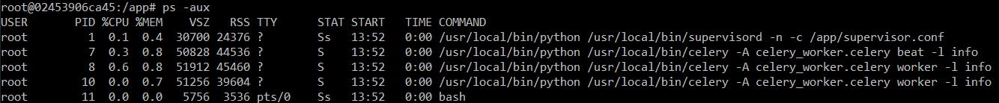
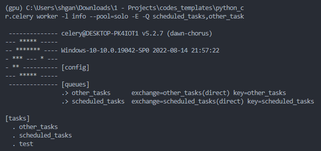
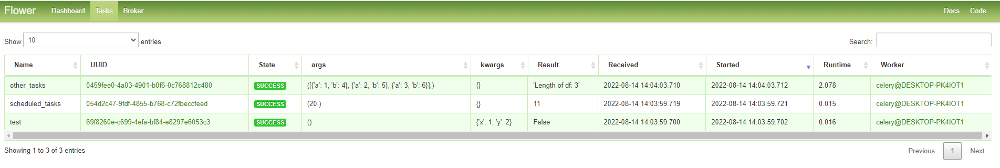
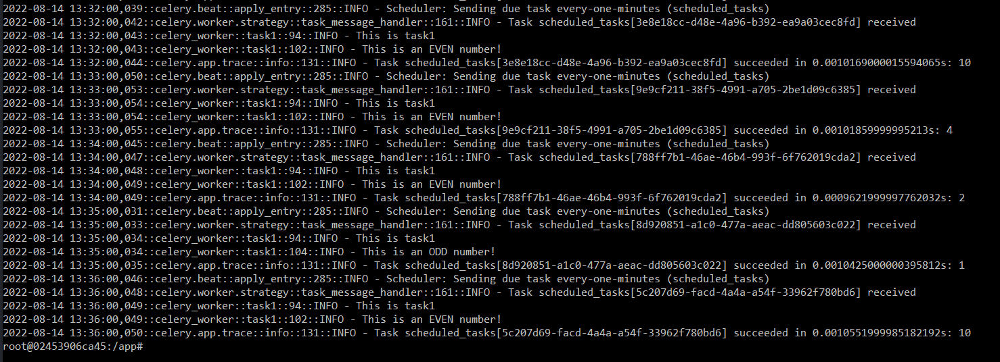
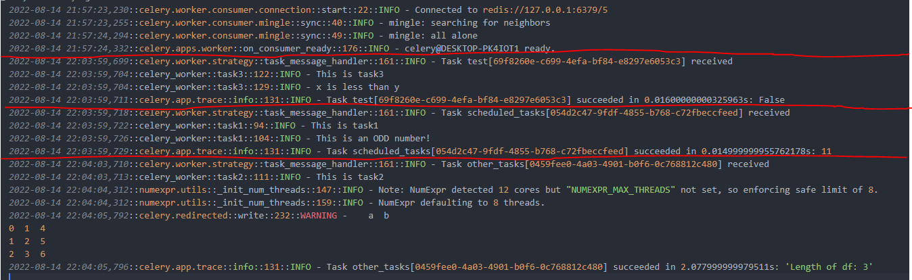
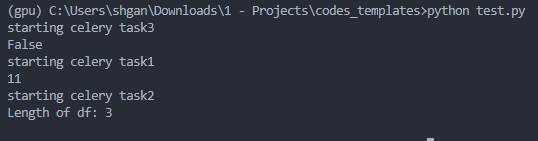

# python_celery

## About The Project
This repository shows the basic configuration to set up celery in Python. Users are able to schedule tasks and run time-intensive tasks asynchronously using celery.

In this example, we will be using **Redis** as both the broker and the backend for the celery worker. For reusability and simplicity, we will be dockerizing Redis using `redis:6.2-alpine` image. I will be introducing two ways of setting up celery:
1. Using the `celery` command line utility
2. Using `supervisor` and running both in a docker container (although you can also do it without docker)

## Directory Tree
```sh
.
├── .env *
├── celery_worker.py *
├── docker-compose.yaml *
├── Dockerfile
├── requirements.txt
├── supervisor.conf
└── README.md
```
\* You only need files marked with * if you are not planning to containerize celery.

## Prerequisites
The following libraries are required to run the script:
1. celery
2. flower (optional)
3. redis
4. supervisor (optional)
5. python-dotenv
6. pandas
7. ipython

*No installation is required if you are runnning celery in Docker containers.*

## Usage
### Option 1: Dockerize everything
1. Make sure that the REDIS_HOST in .env is set correctly:
    ```sh
    REDIS_HOST=redis
    ```
2. Run the following command to start multiple docker containers:
    ```sh
    docker-compose up
    ```
3. All your containers should be running and you can access flower UI at `localhost:5556`
### Option 2: Run celery locally
1. Make sure that the REDIS_HOST in .env is set to localhost:
    ```sh
    REDIS_HOST=127.0.0.1
    ```
2. Comment out `app` and `flower` services in `docker-compose.yaml`
3. Run the following commands in different terminals:
    ```sh
    celery -A celery_worker.celery worker -l info --concurrency=1 -Q scheduled_tasks,other_tasks
    celery -A celery_worker.celery beat -l info
    celery -A celery_worker.celery flower --port=5555
    ```
4. All your services should be running and you can access flower UI at `localhost:5555`

## Demo
Sample test cases are written in the test.py file. [Here](https://github.com/shaohong-g/codes_templates/blob/main/test.py) 

### PID in docker containers
Image shows celery worker and celery beat runs from supervisor.

To run `ps` command, install this within the container (or you can add this to dockerfile and rerun everything):
```sh
apt-get update && apt-get install procps
```


### Celery worker
Celery worker showing the tasks available and the queues which they are listening to.



### Flower UI (Optional)
Flower UI is a web UI for celery. It is useful for debugging and monitoring celery.



### Sample log showing scheduled_tasks
Celery beat sending tasks every 1 minute:



### test.py
Celery worker receive tasks from `test.py` and reflect in `output.txt`:



Celery worker receive tasks from `test.py` and reflect in `console`:




## Useful Articles / Acknowledgements
- [Customize celery logs - 1](https://stackoverflow.com/questions/39265344/how-to-send-celery-all-logs-to-a-custom-handler-in-my-case-python-logstash-han)
- [Customize celery logs - 2](https://stackoverflow.com/questions/52086417/assistance-with-celery-logging)
- [Customize celery logs - 3](https://www.distributedpython.com/2018/08/28/celery-logging/)
- [Parsing Dataframe to Celery Argument](https://stackoverflow.com/questions/48510690/how-do-i-pass-in-a-python-pandas-dataframe-object-as-an-argument-to-a-celery-tas)
- [Windows limitation](https://stackoverflow.com/questions/59927934/valueerror-not-enough-values-to-unpack-expected-3-got-0-when-starting-celery)
- [Task routing](https://stackoverflow.com/questions/51631455/how-to-route-tasks-to-different-queues-with-celery-and-django)
- [Run tasks instantly for beat schedule](https://stackoverflow.com/questions/28961517/celery-beat-schedule-run-task-instantly-when-start-celery-beat)
- [Periodic Tasks for Celery Beat](https://docs.celeryq.dev/en/stable/userguide/periodic-tasks.html)
- [Setting up Supervisord for Celery (Template)](https://github.com/celery/celery/tree/master/extra/supervisord)
- [Run supervisord in foreground](https://stackoverflow.com/questions/67195479/supervisord-exits-inside-docker-container-when-run-with-docker-compose-command)